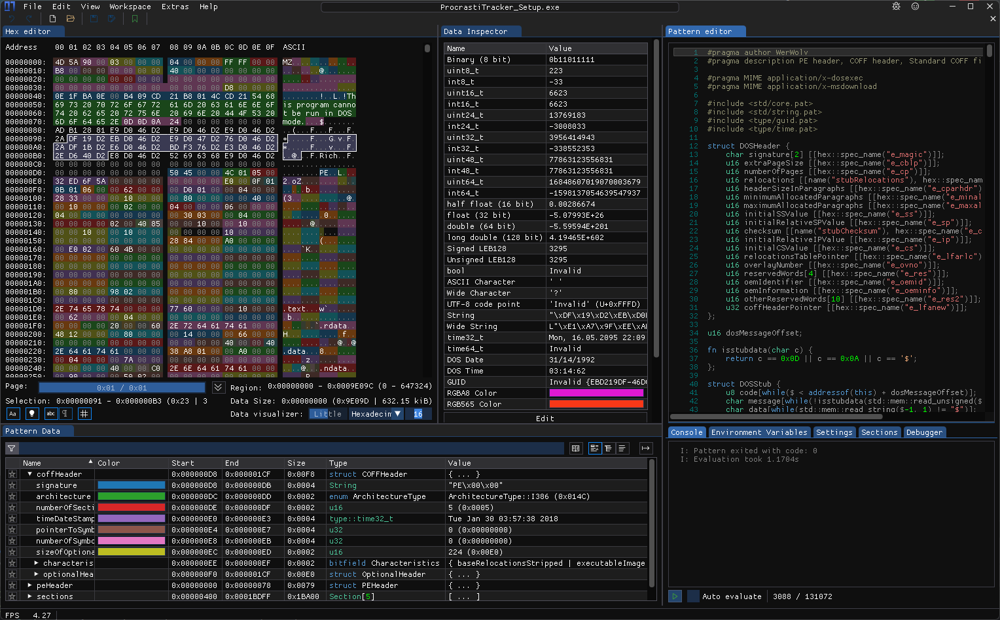
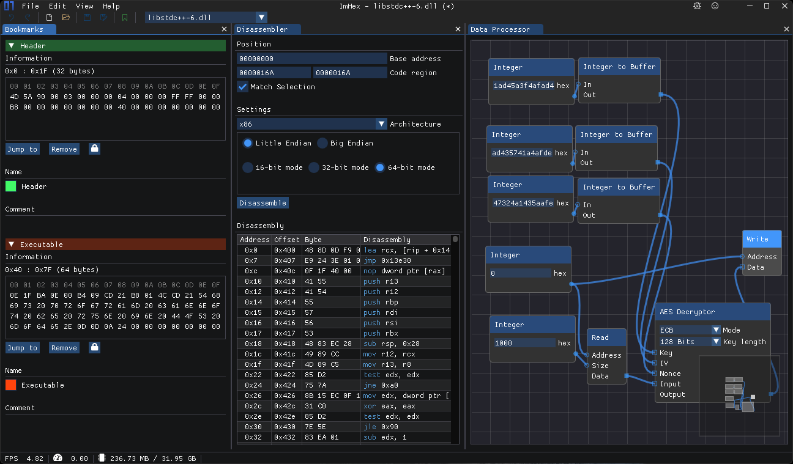

# awesome-project
一些好用的项目软件收藏

#### [ImHex](https://github.com/WerWolv/ImHex)
Hex编辑器，暗黑主题模式，支持macOS, Linux, windows

#### [gpu-burn](https://github.com/wilicc/gpu-burn)
GPU 压测工具

#### [tunasync](https://github.com/tuna/tunasync)
清华开源镜像源同步工具

#### [concourse](https://github.com/concourse/concourse)
基于容器的 cicd 平台

#### [iina](https://github.com/iina/iina)
macOS平台视频播放器

#### [n2n](https://github.com/ntop/n2n)
Peer-to-peer VPN

#### [tkng](https://www.tkng.io/)
k8s网络指南

### [zx](https://github.com/google/zx)
google 开源JavaScript脚本执行工具

### [Temporal](https://github.com/temporalio/temporal)
分布式工作流引擎
k8s网络指南

#### [slidev](https://github.com/slidevjs/slidev)

为开发者打造的演示文稿工具
